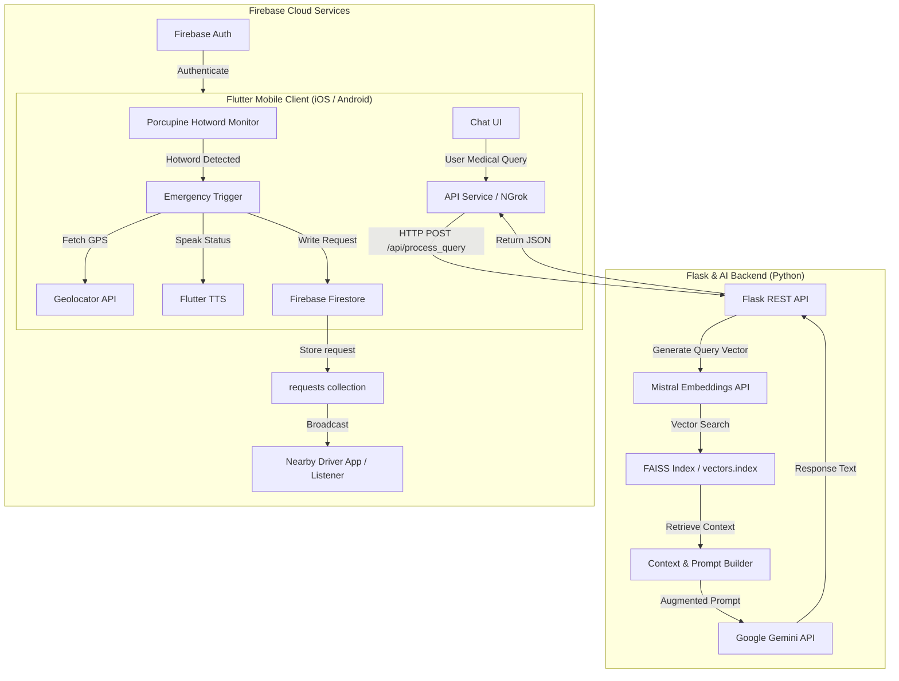

# Emage: Voice-Activated Emergency & Medical Assistant

An advanced, AI-powered emergency assistance mobile application built with Flutter, integrated with a Flask-based Retrieval-Augmented Generation (RAG) backend. The platform provides immediate hands-free distress alerting through offline voice command monitoring and delivers context-aware, first-aid medical guidance backed by LLMs.

---

## 🌟 Key Features

- **Offline Hotword Detection**: Integrates **Picovoice Porcupine SDK** in a persistent background service to detect wake words ("Hey Google", "Alexa", or custom hotwords) even when the app is minimized.
- **RAG-powered Medical Guidance**: Hosts a medical information retrieval pipeline backed by **FAISS**, **Mistral Embeddings**, and the **Google Gemini API** (`gemini-1.5-flash`) to generate safe first-aid responses.
- **Real-time Emergency Dispatch**: Coordinates with location APIs and broadcasts instant help requests containing user medical profiles to nearby emergency services or drivers.
- **Interactive Map & Navigation**: Uses **Google Maps SDK** to visualize emergency routing, calculate distances (Haversine formula), and display nearby medical centers.
- **Hands-Free Accessibility**: Utilizes built-in **Text-to-Speech (TTS)** to speak out instructions and confirm actions out loud during high-stress situations.

---

## 🏗️ Architecture & System Design



---

## 📂 Project Structure

```
Emage/
├── emage/                         # Flutter Mobile Application
│   ├── android/                   # Android native configuration
│   ├── ios/                       # iOS native configuration
│   ├── assets/                    # Local assets (icons, custom .ppn wake-word files)
│   ├── flask_backend/             # Python-based AI RAG Backend
│   │   ├── app.py                 # REST API endpoints
│   │   ├── rag_pipeline.py        # Mistral Embedding + Gemini RAG logic
│   │   ├── speech_service.py      # Query processing coordinator
│   │   └── vectors.index          # FAISS vector store file
│   └── lib/                       # Flutter Dart codebase
│       ├── main.dart              # App initialization & service setup
│       ├── services/              # Core business services
│       │   ├── api_service.dart   # Flask REST API communicator
│       │   ├── emergency_service.dart # Dispatch & firestore operations
│       │   ├── location_service.dart  # Geolocation & geocoding helper
│       │   └── voice_command_service.dart # Background hotword monitoring
│       ├── chatbot_page.dart      # RAG Medical Chatbot Interface
│       └── home_page.dart         # Main Hub screen
└── README.md                      # Documentation
```

---

## 🚀 Setup & Installation

### 1. Backend Setup (Flask & AI)
Make sure you have Python 3.9+ installed.

1. Navigate to the backend directory:
   ```bash
   cd emage/flask_backend
   ```
2. Install dependencies:
   ```bash
   pip install flask flask-cors google-genai mistralai numpy faiss-cpu
   ```
3. Set your environment variables (or configure keys directly in `rag_pipeline.py`):
   ```bash
   export GEMINI_API_KEY="your-gemini-api-key"
   export MISTRAL_API_KEY="your-mistral-api-key"
   ```
4. Start the server:
   ```bash
   python app.py
   ```

### 2. Frontend Setup (Flutter)
Ensure you have the Flutter SDK installed and configured.

1. Navigate to the flutter app directory:
   ```bash
   cd emage
   ```
2. Fetch dependencies:
   ```bash
   flutter pub get
   ```
3. Setup Ngrok or update the API endpoint in `lib/services/api_service.dart` to match your backend's host address.
4. Run the app on an Emulator or physical device:
   ```bash
   flutter run
   ```

---

## 🛡️ Security & Permissions
The application requires the following permissions to operate reliably in the background:
- **Microphone**: For Porcupine offline hotword monitoring.
- **Location**: To retrieve coordinates during a dispatch trigger.
- **Notifications**: To maintain the **Flutter Foreground Task** lifecycle and keep the wake-word service alive.
